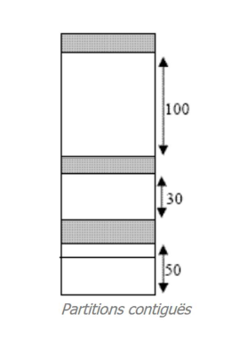
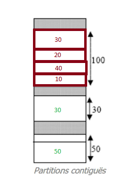
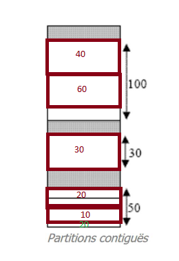
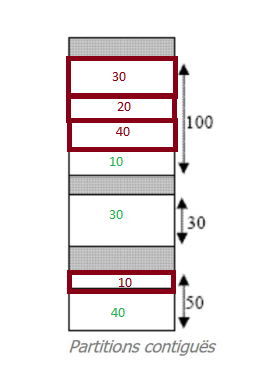
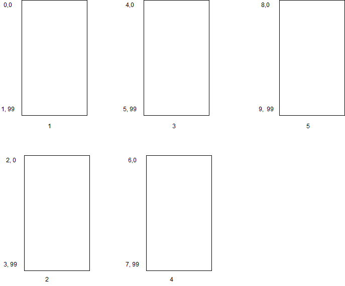

# Gestion mémoire
## Exercice 1 : Allocation de partitions contigües

On cherche à traiter les suites de demandes : 30,20,40,60,10.
On a une mémoire de la forme :



### First Fit

Il doit attendre pour pouvoir traiter le 60, et peut ainsi entrer en famine (si on a des cases de 30 qui arrivent successivement, elles seront traitées mais pas le 60)
### Best Fit


### Worst Fit


## Exercice 2 : Pagination et adressage
8 bits pour la page, 12 bits pour le décallage.
Taille de la mémoire virtuelle : $2^{20}$ mots → $2^8$ pages

Dans chaque page il y a $2^{12}$ mots

## Exercice 3 : Traduction d'adresse logique

*Memo : Adresse logique == adresse virtuelle.*

- Combien de bits se trouvent dans une adresse logique ?  

Format d'une adresse virtuelle :
| P(age) | d(écallage)   |
| :------------- | :------------- |
| 19...12 | 11...0 |

8 bits pour représenter le numero de page, 10 bits représenter taille d'une page donc 8+10=18 bits pour une adresse logique.

- Quelle est la taille d'une case ?

La taille d'une case est la taille d'une page : $2^{10}$ octets.

- Combien de bits de l'adresse physique spécifient la case ?

$\frac{2^{14}}{2^{10}}=2^4$
Il faut donc 4 bits pour l'adresse physique de la case.

- Combien d'entrées se trouvent dans la table de pages ?

256 car on a 256 pages.

- Quelle est la largeur de la table de pages (taille d'une entrée) ?

Une entrée dans la table des pages spécifie un numéro de case, il faut donc 4 bits puisqu'on a $2^4$ cases.

*Remarque : petite erreur dans l'énoncé, on a $2^{14}$ et $2^{10}$ et non pas 214 et 210 octets.*

## Exercice 4 : Pagination à la demande

La taille d'une page est de 100mots. La chaine des références est la suite des numéros de pages auxquelles on peut accéder.

- Donner la chaîne de références correspondante si on suppose que la taille d'une page est de 100 mots.

`0 0 1 1 0 3 1 2 2 4 4 3`

- Calculer le nombre de défauts de pages générés pour une mémoire centrale de 200 mots en utilisant les algorithmes de remplacement FIFO, LRU.

Sachant que la taille d'une page est de 100 mots, on va donc avoir deux pages chargées pour une mémoire centrale de 200 mots.

**FIFO** :

|  init  |   |   |   |   |   |   |   |   |   |   |   |   |
| :- | :- | :- | :- | :- | :- | :- | :- | :- | :- | :- | :- | :- |
|    |  0  |  0  |  0  |  0  |  0  |  3  |  3  |  3  |  3  |  4  |  4  |  4  |
|    |    |    |  1  |  1  |  1  |  1  |  1  |  2  |  2  |  2  |  2  |  3  |
|    |  *  |    |  *  |    |    |  *  |    |  *  |    |  *  |    |  *  |

\* : 6 défaut de page

**LRU** : On remplace la plus ancienne page qui a été référencée
|  init  |   |   |   |   |   |   |   |   |   |   |   |   |
| :- | :- | :- | :- | :- | :- | :- | :- | :- | :- | :- | :- | :- |
|    |  0  |  0  |  0  |  0  |  0  |  0  |  1  |  1  |  1  |  4  |  4  |  4  |
|    |    |    |  1  |  1  |  1  |  3  |  3  |  2  |  2  |  2  |  2  |  3 |
|    |  *  |    |  *  |    |    |  *  |  *  |  *  |    |  *  |    |  *  |

\* : 7 défaut de page

- On suppose maintenant que la taille d'une page est de 200 mots et la mémoire principale est de 400 mots. Refaire les questions précédentes. Que peut-on en déduire ?  

`0 0 0 0 0 1 0 1 1 2 2 1`

**FIFO** : 3 défauts de pages  
**LRU** : 3 défauts de pages

> On en déduit qu'en augmentant la taille des pages on aura moins de défauts de pages pour y accéder.

## Exercice 5 : Placement mémoire et performances
1000 octets sont necessaires pour représenter la matrice. La taille d'une page est de 200 octets.

> Il nous faut donc 5 pages pour représenter nos données.



### Algo 1
On remplit par ligne par ligne.  
```
0 1 2 3 4
```

On a le droit à 3 pages (car mémoire centrale de 600octets cette fois)

|  init  |   |   |   |   |   |   |
| :- | :- | :- | :- | :- | :- | :- |
|    |  0  |  0  |  0  |  0  |  0  |  0  |
|    |    |    |  1  |  1  |  1  |  3  |
|    |    |    |    |  2  |  3  |  4  |
|    |  *  |  *  |  *  |  *  |  *  |  *  |

**OPTIMAL** : 5ddp
**LRV** : 5ddp

### Algo 2
On remplit par colonne par colonne :  
```
0 1 2 3 4  
0 1 2 3 4  
0 1 2 3 4  
...  
100x
```

|  init  |   |   |   |   |   |   |   |   |   |   |   |   |   |   |   |
| :- | :- | :- | :- | :- | :- | :- | :- | :- | :- | :- | :- | :- | :- |:- |:- |
|    |  0  |  0  |  0  |  0  |  0  |  0  |  0  |  0  |  0  |  0  |  0  |  0  | 1  |0 | ...   |
|    |    |    |  1  |  1  |  1  |  1  |  1  |  1  |  2  |  3  |  3  |  3  | 3  |3  |...  |
|    |    |    |    |  2  |  3  |  4  |  4  |  4  |  4  |  4  |  4  |  4  | 4  |4 | ...   |
|    |  *  |  *  |  *  |  *  |  *  |  *  |    |    |  *  |  *  |    |    | *  |*  |...  |

On remarque que les défauts de pages vont être cycliques : on en a 5 au départ, puis 2 défauts séparés par 2 sans défauts.
On va diviser par blocs de 4, dans lesquels on va avoir 2 défauts de pages (sauf dans le premier où on en
4). On va donc avoir 496/4 = 124 ; 124 * 2 = 248. On ajoute les 4 de départ et on a 248 + 4 = 252.

**LRU** : 500 défauts de pages (puisqu'on remplace la dernière qui a été référencée)
