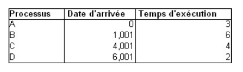

# TD9 - Ordonnancement des processus

## Exercice 1 : Ordonnancement classique

On souhaite faire le diagramme d'execution des processus selon plusieurs algorithmes.

### FCFS (First Come First Served)

|0|3|9|13|15|
|:-|:-|:-|:-|:-|:-|
||A|B|C|D||

**Temps de rotation moyen (TRM) :**  
3+6+4+2/4=3.75  
*correspond à la durée moyenne nécessaire pour qu'un processus termine
son exécution*  

**Temps de traitement moyen (TTM) :**  
(3-0)+(9-1,001)+(11-4,001)+(15-6,001)/4=6.75

### SJF (Shortest Job First)

|0|3|9|13|15|
|:-|:-|:-|:-|:-|:-|
||A|B|D|C||

**Temps de rotation moyen :**  
3+6+4+2/4=3.75  

**Temps de traitement moyen :**  
(3-0)+(9-1,001)+(11-6,001)+(15-4,001)/4=6.75

### SRT (Shortest Remaining Time) avec un quantum = 1

|0|1|2|3|4|5|6|7|8|9|10|11|12|13|14|15|
|:-|:-|:-|:-|:-|:-|:-|:-|:-|:-|:-|:-|:-|:-|:-|:-|
||A|A|A|B|B|B|B|B|B|D|D|C|C|C|C|

Encore une fois, même temps de rotation et de traitement moyen.

*Remarque : On ne permute pas B avec C à l'instant 4 car on a B et C qui sont "à égalité", ils ont le même temps d'execution restant : on ne va pas commuter le contexte alors que B est déjà chargé : on continue avec B.*

### Tourniquet RR (Round Robin, quantum=2)

|0|1|2|3|4|5|6|7|8|9|10|11|12|13|14|15|
|:-|:-|:-|:-|:-|:-|:-|:-|:-|:-|:-|:-|:-|:-|:-|:-|
||A|A|B|B|A|B|B|C|C|D|D|B|B|C|C|

**Temps de rotation moyen :**  
2+2+1+2+2+2+2+2/8=**1.875 **

**Temps de traitement moyen :**  
(5-0)+(13-1,001)+(15-4,001)+(11-6,001)/4=**6.75**

### Tourniquet RR (Round Robin, quantum=1)

|0|1|2|3|4|5|6|7|8|9|10|11|12|13|14|15|
|:-|:-|:-|:-|:-|:-|:-|:-|:-|:-|:-|:-|:-|:-|:-|:-|
||A|A|B|A|B|C|B|C|D|B|C|D|B|C|B|

**Temps de rotation moyen :**  
2+1+1+1+1+1+1+1+1+1+1+1+1+1+1/14=**1.14**

**Temps de traitement moyen :**  
(4-0)+(15-1,001)+(14-4,001)+(12-6,001)/4=**8.5**

## Exercice 2 : Ordonnancement avec plusieurs files

F1 : P3, P6  
F2 : P1, P4, P7  
F3 : P2, P5  

### SJF (Shortest Job First)
|0|4|6|7|8|15|19|25|
|:-|:-|:-|:-|:-|:-|:-|:-|:-|
||P2|P5|P4|P7|P1|P6|P3|

**TRM :**  
4+2+1+1+7+4+6/7=**3.57**

**TTM :**  
((4-0)+(6-1)+(7-1)+(8-2)+(15-0)+(19-2)+(25-1))/7=**11**

### Tourniquet RR (Round Robin, quantum=2)

F1 : P3(6), P6(4)  
F2 : P1(7), P4(1), P7(1)  
F3 : P2(4), P5(2)  

|0|1|2|3|4|5|6|7|8|9|10|11|12|13|14|15|16|17|18|19|20|21|22|23|24|25|
|:-|:-|:-|:-|:-|:-|:-|:-|:-|:-|:-|:-|:-|:-|:-|:-|:-|:-|:-|:-|:-|:-|:-|:-|:-|:-|
||P2|P2|P5|P5|P2|P2|P1|P1|P4|P7|P1|P1|P1|P1|P1|P3|P3|P6|P6|P3|P3|P6|P6|P3|P3|

**TRM :**  
2+2+2+2+1+1+5+2+2+2+2+2/12=**2.08**

**TTM :**  
*Dans l'ordre d'arrivée dans le tableau : P2,P5,P1,P4,P7,P3,P6*
((6-0)+(4-1)+(15-0)+(9-1)+(10-2)+(25-1)+(23-2))/7=**12,14**

### SRT (Shortest Remaining Time, quantum=1)

|0 |1 |2 |3 |4 |5 |6 |7 |8 |9 |10|11|12|13|14|15|16|17|18|19|20|21|22|23|24|25|
|:-|:-|:-|:-|:-|:-|:-|:-|:-|:-|:-|:-|:-|:-|:-|:-|:-|:-|:-|:-|:-|:-|:-|:-|:-|:-|
|  |P2|P5|P5|P2|P2|P2|P4|P7|P1|P1|P1|P1|P1|P1|P1|P6|P6|P6|P6|P3|P3|P3|P3|P3|P3|

**TRM :**  
1+2+3+1+1+7+1+6/8=**2.75**

**TTM :**  
*Dans l'ordre d'arrivée dans le tableau : P2,P5,P4,P7,P1,P6,P3*
((6-0)+(3-1)+(7-1)+(8-2)+(15-0)+(19-2)+(25-1))/7=**10.9**

## Exercice 3 : Ordonnancement avec priorité

|0 |1 |2 |3 |4 |5 |6 |7 |8 |9 |10|11|12|13|14|15|16|17|
|:-|:-|:-|:-|:-|:-|:-|:-|:-|:-|:-|:-|:-|:-|:-|:-|:-|:-|
|  |P1|P2|P2|P2|P4|P4|P2|P1|P1|P1|P3|P3|P3|P5|P5|P6|P6|

1+3+2+1+3+3+2+2/8 = **2.25**
(10-0)+(7-1)+(6-4)+(13-1)+(15-5)+(17-6)/6=**8.5**
